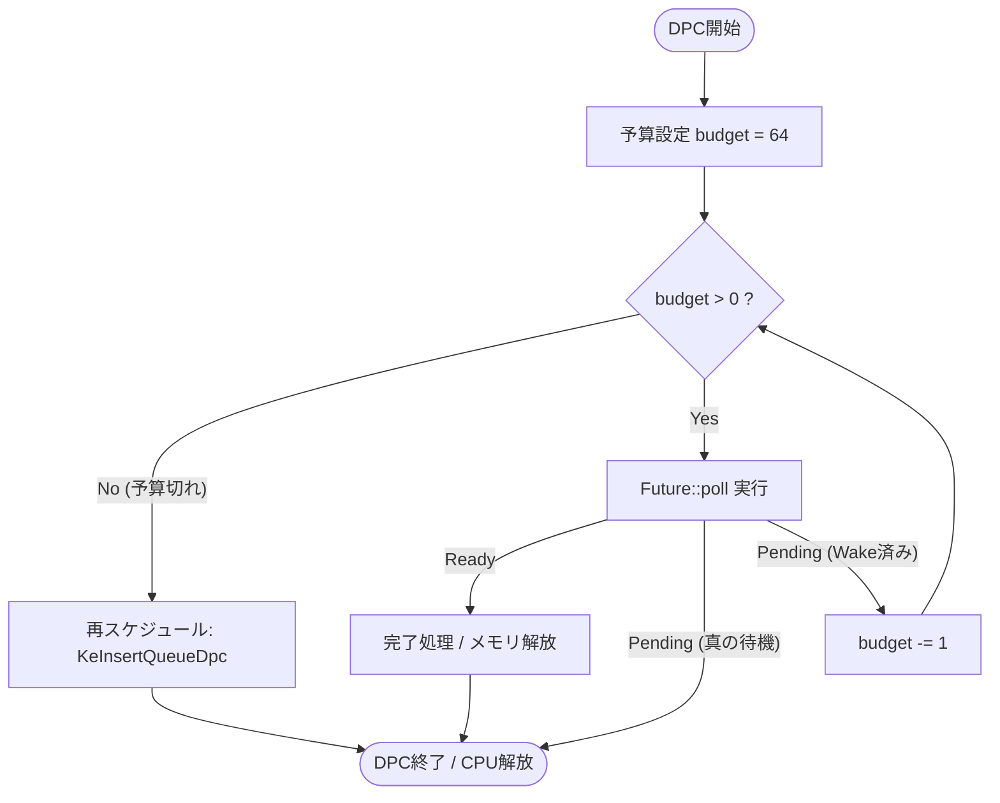

# kcom: Budgeting & Cooperative Scheduling 実装仕様書

## 1. 概要 (Overview)

Windows カーネルの `DISPATCH_LEVEL` (DPC環境) には、厳格な実行時間制限があります。1つの DPC ルーチンが CPU を占有し続けると、以下の致命的な問題が発生します。

1.  **DPC Watchdog Violation (0x133)**: 処理が約 100ms (環境依存) を超えると、OS はシステムがフリーズしたと判断し、BSoD を発生させる。
2.  **System Stuttering**: マウスカーソルの飛び、音声のノイズ、他のドライバの処理遅延など、ユーザー体験を著しく損なう。
3.  **Stack Overflow**: 高速な I/O 完了通知が同期的に連鎖した場合、カーネルスタック（通常 12KB-24KB）を食いつぶす。

本仕様では、タスクの実行に **「予算 (Budget)」** を設け、消費しきった場合に強制的に処理を中断・再スケジュールする **Budgeting 機構** を定義します。

## 2. アーキテクチャ設計

### 2.1. 実行モデル (Execution Model)

再帰呼び出し（Trampolining）ではなく、**「反復型ループ（Iterative Loop）」** を採用します。

*   **従来の再帰モデル (危険)**:
    `poll` → `Ready` → `then` → `poll` ... (スタックが深くなる)
*   **kcom Budgeting モデル**:
    Executor がループ内で `poll` を呼び、Budget を減算する。Budget が尽きたら、まだ処理可能であっても `Pending` 扱いとしてループを抜け、自分自身を DPC キューの末尾に並び直させる。

### 2.2. フローチャート



---

## 3. 実装詳細仕様

### 3.1. `TaskHeader` の変更

`dpc_routine` 内のロジックを変更します。構造体のフィールド追加は必須ではありませんが、動的なチューニングのために設定値を持たせることも可能です。

```rust
// executor.rs

/// 1回のDPC実行で許可される Poll の最大回数
const DEFAULT_TASK_BUDGET: u32 = 64;

impl TaskHeader {
    // DPCコールバック (Executorのメインループ)
    unsafe extern "C" fn dpc_routine(
        dpc: PKDPC,
        context: *mut c_void,
        _: *mut c_void,
        _: *mut c_void,
    ) {
        let ptr = NonNull::new(context as *mut TaskHeader).unwrap();
        
        // スケジュール済みフラグを下ろす
        (*ptr.as_ptr()).scheduled.store(0, Ordering::Release);

        // キャンセルチェック (Async Try-Finally仕様参照)
        if (*ptr.as_ptr()).cancel_requested.load(Ordering::Acquire) != 0 {
             // ... キャンセル処理 ...
             return;
        }

        // ============================================
        // Budgeting Loop Start
        // ============================================
        let mut budget = DEFAULT_TASK_BUDGET;

        loop {
            // 1. 実行
            //    poll() 内で Waker がセットされる
            let poll_result = ((*ptr.as_ptr()).vtable.poll)(ptr.as_ptr());

            match poll_result {
                Poll::Ready(()) => {
                    // 完了: リソース解放して終了
                    Self::dealloc_shim(ptr.as_ptr());
                    return;
                }
                Poll::Pending => {
                    // 2. 継続判定
                    //    poll したが、内部で既に wake() が呼ばれており、
                    //    かつ Budget が残っている場合は、ループして即座に次を実行する
                    
                    // wake() されたかを確認するには「scheduled」フラグを見るのが効率的
                    // (Wakerの実装で wake 時に scheduled を 1 にしている前提)
                    let is_woken = (*ptr.as_ptr()).scheduled.load(Ordering::Acquire) == 1;

                    if is_woken {
                        if budget > 0 {
                            // Budgetあり: 次のループへ (Trampolining)
                            // scheduled フラグを消費して継続
                            (*ptr.as_ptr()).scheduled.store(0, Ordering::Relaxed);
                            budget -= 1;
                            continue;
                        } else {
                            // Budget切れ (Yield):
                            // ここで何もしないことで、scheduled=1 のまま関数を抜ける。
                            // すると、既に DPC キューに入っている（あるいは wake で入る）ため、
                            // OS が他の処理をした後に、再度 dpc_routine が呼ばれる。
                            return;
                        }
                    } else {
                        // 本当の Pending (I/O待ちなど): 
                        // DPCを抜けて寝る
                        return;
                    }
                }
            }
        }
    }
}
```

### 3.2. `Waker` の実装 (連動)

Budgeting を機能させるためには、`Waker::wake()` が「再帰的に `poll` を呼ばない」かつ「DPC キューへの登録を適切に行う」必要があります。

```rust
impl TaskHeader {
    // Waker::wake() から呼ばれる
    unsafe fn wake_raw(ptr: NonNull<TaskHeader>) {
        // 1. スケジュール済みフラグを Atomic CAS でチェック
        if (*ptr.as_ptr()).scheduled.swap(1, Ordering::AcqRel) == 0 {
            // 2. まだスケジュールされていなければ、DPCキューに入れる
            //    注: もし現在このタスクが実行中(Current CPU)であれば、
            //    KeInsertQueueDpc は失敗する可能性があるが、
            //    scheduled=1 になっていれば dpc_routine のループで拾われるので問題ない。
            KeInsertQueueDpc(&mut (*ptr.as_ptr()).dpc, ...);
        }
    }
}
```

### 3.3. コンフィギュレーション (Optional)

タスクの性質に応じて Budget を動的に変更できるようにします。

```rust
/// タスクの優先度・性質定義
pub enum TaskPriority {
    /// 低遅延優先。Budget小 (16)。
    /// 他のシステム処理に頻繁にCPUを譲る。UI操作などへの影響を最小限にする。
    Interactive,
    
    /// スループット優先。Budget大 (256)。
    /// キャッシュフラッシュなど、一気に終わらせたい処理向け。
    Batch,
    
    /// 標準 (64)。
    Default,
}

pub fn spawn_with_priority<F>(future: F, priority: TaskPriority) -> NTSTATUS {
    let budget = match priority {
        TaskPriority::Interactive => 16,
        TaskPriority::Default => 64,
        TaskPriority::Batch => 256,
    };
    // TaskHeader に初期 budget を保存しておくフィールドを用意して渡す
    Task::allocate(future, budget)
}
```

---

## 4. 効果検証 (Verification)

この実装が正しく機能しているかは、以下のシナリオで確認できます。

1.  **無限ループタスクの投入**:
    `async { loop { yield_now().await; } }` のような終わらないタスクを `spawn` する。
    *   **Budgeting なし**: システムが完全にフリーズし、数秒後に BSoD (0x133) が発生する。
    *   **Budgeting あり**: CPU 使用率は 100% (1コア分) になるが、マウスは動き、システムは応答し続ける。BSoD は起きない。

2.  **Google Drive からの大量 Read**:
    キャッシュ済みの小さなファイル 10,000 個を連続で読み込む。
    *   スタックオーバーフローが発生せず、かつシステム全体のレスポンス（動画再生など）がカクつかないことを確認する。

## 5. 実装上の注意点

1.  **DPC キューの性質**:
    `KeInsertQueueDpc` は、ターゲット CPU の DPC キューの **末尾** に追加されます。これにより、Budget 切れで再スケジュールした場合、他の待機中の DPC（ネットワークカードの割り込み処理など）が先に実行されることが保証され、「公平性（Fairness）」が実現されます。

2.  **`yield_now()` の提供**:
    ユーザーコード側で明示的に Budget を消費して中断したい場合のために、`Yield` フューチャーを提供すると親切です。

    ```rust
    pub async fn yield_now() {
        struct YieldNow { yielded: bool }
        impl Future for YieldNow {
            fn poll(...) -> Poll<()> {
                if self.yielded { Poll::Ready(()) }
                else {
                    self.yielded = true;
                    cx.waker().wake_by_ref(); // Budgetを1消費してループさせる
                    Poll::Pending
                }
            }
        }
        YieldNow { yielded: false }.await
    }
    ```

---

この Budgeting 機構を実装することで、`kcom` は単なる非同期ラッパーを超え、**「OS のスケジューラと協調して動作する、堅牢なカーネルランタイム」** に進化します。これは商用利用に耐えうる品質の証です。